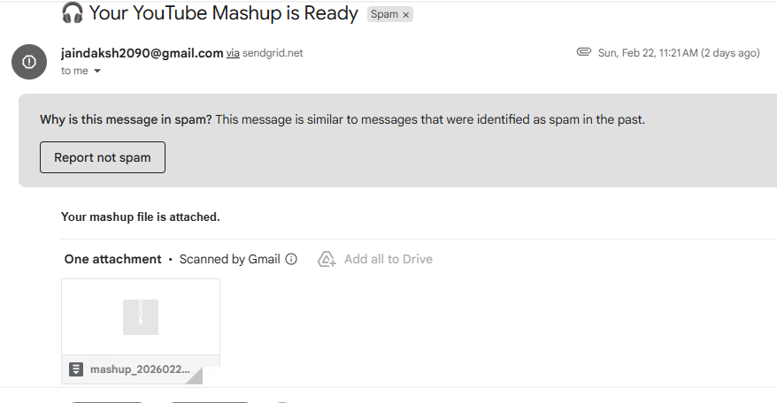

# YouTube Mashup Automation Pipeline

An automated media processing system built with Python and Streamlit that generates a custom audio mashup from YouTube search results.

This application allows users to search for a topic, automatically download relevant videos, extract audio segments, combine them into a mashup, and generate a compressed output file - all through a simple web interface.

---

## Overview

The pipeline performs the following operations:

- Searches YouTube videos based on a user-provided keyword  
- Downloads selected videos using yt-dlp  
- Converts video files into audio format  
- Extracts the first 30 seconds from each audio file  
- Merges all extracted clips into a single mashup track  
- Compresses the final output into a ZIP archive  
- Provides downloadable output with optional email delivery  

The system follows a modular architecture to ensure maintainability and scalability.

---

## Application Workflow

1. User enters a search keyword  
2. User specifies the number of videos to process  
3. The system downloads matching YouTube videos  
4. Each video is converted into an audio file  
5. The first 30 seconds of each audio track is extracted  
6. All extracted clips are concatenated sequentially  
7. The final mashup file is compressed into a ZIP archive  
8. The user downloads the generated output  

---
## Output Example 

Insert a screenshot of the generated mashup result or email output below. 

 

---

## Project Structure

```
youtube_mashup_pipeline/
│
├── app.py
├── requirements.txt
├── README.md
│
├── config/
│   └── settings.py
│
├── pipeline/
│   ├── downloader.py
│   ├── audio_converter.py
│   ├── cutter.py
│   ├── merger.py
│   ├── zipper.py
│   └── mailer.py
│
├── utils/
│   └── helpers.py
│
├── data/
│   ├── videos/
│   ├── audios/
│   ├── clips/
│   ├── output/
│   └── zip/
```

---

## Architectural Design

The project follows a layered modular pipeline architecture with clear separation of responsibilities:

- `downloader.py` handles YouTube search and video download using yt-dlp  
- `audio_converter.py` converts video files into audio using MoviePy  
- `cutter.py` extracts fixed-length audio segments using Pydub  
- `merger.py` combines multiple audio clips into a single mashup  
- `zipper.py` compresses the generated mashup  
- `mailer.py` manages optional email delivery  
- `helpers.py` handles directory creation and cleanup  

The Streamlit interface is kept separate from the processing logic to maintain clean architecture principles.

---

## Technologies Used

- Python 3.11  
- Streamlit  
- yt-dlp  
- MoviePy (v1.0.3)  
- Pydub  
- FFmpeg  
- Resend API (for optional email delivery)  

---

## Key Features

- User-controlled number of videos  
- Fully automated processing pipeline  
- Modular and maintainable architecture  
- Automatic directory management  
- ZIP archive generation  
- Optional email integration  

---

## Deployment Notes

This application relies on FFmpeg and performs media-intensive operations. It is best suited for:

- Local execution  
- Docker-based deployment  
- Containerized cloud environments  

For scalable deployment, Docker containerization is recommended.

---

## Possible Improvements

- Allow custom clip duration  
- Add volume normalization  
- Introduce background task processing  
- Implement parallel downloading  
- Add cloud storage integration  
- Provide progress indicators in UI  

---

## Author

Daksh Jain  
B.Tech Student  
Third Year
